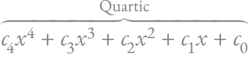

# ReX &nbsp; [](https://github.com/KenyC/ReX)

<p align="center"></p>
<h3 align="center">Typesetting Mathematics</h3>

This is a fork of [ReX](https://github.com/cbreeden/rex), a Rust mathematical typesetting engine.

# Why the fork?

This fork of ReX is designed to allow users to use their preferred rendering engine and font parser. I also plan on continue making bug fixes and improvements (use Issues tab to request features and report bugs)

Rendering engine supported:

 - [FemtoVG](https://crates.io/crates/femtovg) : feature `femtovg-renderer`
 - [Cairo](https://crates.io/crates/cairo-rs) : feature `cairo-renderer`
 - [Raqote](https://crates.io/crates/raqote) : feature `raqote-renderer`
 - [Pathfinder](https://github.com/servo/pathfinder) : feature `pathfinder-renderer`


Font parser supported:

  - [ttfparser](https://crates.io/crates/ttf-parser) : feature `ttfparser-fontparser` 
  - [font](https://github.com/pdf-rs/font) : feature `font-fontparser`

You may add support for other font parser by implementing the `MathFont` trait and other rendering engines by implementing `Backend<F>` where `F` is a `MathFont` type.


# Features / TODO list

  - [x] Font change (`\mathbf`, `\mathrm`, `\mathfrak`, etc.)
  - [x] Fractions
  - [x] Delimiters and extensible symbols `\left\lbrace x \middle| x = 0 \right\rbrace`
  - [x] Arrays, matrices
  - [x] Sub- and super-scripts
  - [x] Text fragment `\text{...}`
  - [x] Custom macros
  - [x] Misc. font effects: `\boldsymbol`, `\bm`, and `\underline`


# Samples

### The Quadratic Formula
`x = \frac{-b \pm \sqrt{b^2 - 4ac}}{2a}`


### Double angle formula for Sine
`\sin(\theta + \phi) = \sin(\theta)\cos(\phi) + \sin(\phi)\cos(\theta)`


### Divergence Theorem
`\int_D (\nabla \cdot F)\,\mathrm{d}V = \int_{\partial D} F \cdot n\,\mathrm{d}S`


### Standard Deviation
`\sigma = \sqrt{ \frac{1}{N} \sum_{i=1}^N (x_i - \mu)^2 }`


### Fourier Inverse
`f(x) = \int_{-\infty}^{\infty} \hat f(\xi) e^{2\pi i \xi x}\,\mathrm{d}\xi`


### Cauchy-Schwarz Inequality
`\left\vert \sum_k a_kb_k \right\vert \leq \left(\sum_k a_k^2\right)^{\frac12}\left(\sum_k b_k^2\right)^{\frac12}`


### Exponent
`e = \lim_{n \to \infty} \left(1 + \frac{1}{n}\right)^n`


### Ramanujan's Identity
`\frac{1}{\pi} = \frac{2\sqrt{2}}{9801} \sum_{k=0}^\infty \frac{ (4k)! (1103+26390k) }{ (k!)^4 396^{4k} }`


### A surprising identity
`\int_{-\infty}^{\infty} \frac{\sin(x)}{x}\,\mathrm{d}x = \int_{-\infty}^{\infty}\frac{\sin^2(x)}{x^2}\,\mathrm{d}x`


### Another gem from Ramanujan
`\frac{1}{\left(\sqrt{\phi\sqrt5} - \phi\right) e^{\frac{2}{5}\pi}} = 1 + \frac{e^{-2\pi}}{1 + \frac{e^{-4\pi}}{1 + \frac{e^{-6\pi}}{1 + \frac{e^{-8\pi}}{1 + \cdots}}}}`


### Another gem from Cauchy
`f^{(n)}(z) = \frac{n!}{2\pi i} \oint \frac{f(\xi)}{(\xi - z)^{n+1}}\,\mathrm{d}\xi`


### An unneccesary number of scripts
`x^{x^{x^x_x}_{x^x_x}}_{x^{x^x_x}_{x^x_x}}`


### Quartic Function
`\mathop{\overbrace{c_4x^4 + c_3x^3 + c_2x^2 + c_1x + c_0}}\limits^{\gray{\mathrm{Quartic}}}`



### Another fun identity
`3^3 + 4^4 + 3^3 + 5^5 = 3435`


# Usage

## As an executable

You can see a simple example of use in [examples/svg_basic.rs](examples/svg_basic.rs). To run this example, run the following in the root of the repository.

```bash
cargo r --example svg-basic --features="cairo-renderer ttfparser-fontparser" -- "\oint \mathbf{E}\cdot \mathrm{d}\mathbf{A} = \frac{Q_{enc}}{\epsilon_0}"
```

The program will render the formula and output to `test.svg`.

You can see the same result in a GUI with:

```bash
cargo r --example gui-basic --features="femtovg-renderer ttfparser-fontparser" -- "\oint \mathbf{E}\cdot \mathrm{d}\mathbf{A} = \frac{Q_{enc}}{\epsilon_0}"
```


## As a library

The crate is primarily intended as a library. To use it as such, first add the following line to `[dependencies]` section of `Cargo.toml`:

```toml
rex = {git = "https://github.com/KenyC/ReX", features = ["ttfparser-fontparser", "cairo-renderer"]} # replace with whichever features you may need
```


### The simple way

To render, you need to pick:

  1. A font parser that can load a math font: anything that implements `FontBackend`
  2. A graphics backend that can draw shapes to some surface: anything that implements `GraphicsBackend<F>`


For instance, using the `ttf_parser` crate as our font parser and the `cairo` crate as our renderer:

```rust
// create font backend
let font_file = std::fs::read("font.otf").expect("Couldn't load font");
let font = ttf_parser::Face::parse(file, 0).expect("Couldn't parse font.");
let math_font = TtfMathFont::new(font).expect("The font likely lacks a MATH table"); // extracts math info from font
let font_context = FontContext::new(math_font);


// create graphics backend
let svg_surface = cairo::SvgSurface::new(800, 600, Some("out.svg")).expect("Couldn't create SVG surface");
let context = cairo::Context::new(&svg_surface).expect("Couldn't get context for SVG surface");
// The (0, 0) point is the baseline of the first glyph we move it to a reasonable place
context.translate(0., 300.);
let mut backend = CairoBackend::new(context);


rex::render(
  r"e = \lim_{n \to \infty} \left(1 + \frac{1}{n}\right)^n", 
  &mut backend,
  &font_context,
).expect("Error in rendering");

```


### More control


The process of rendering of formula in code is as follows:

  - Create a `FontContext` struct from your font (the font provided by the font parser, e.g. `ttfparser`).
  - Parse the formula into `ParseNode`, using `rex::parser::engine::parse`.
  - Create a `LayoutSettings` struct from this font context, specifying font size.
  - Create a `Layout` from `ParseNode` using `rex::layout::engine::layout`.
  - Create a `Renderer`.
  - Create the relevant renderer backend (e.g. `CairoBackend::new` for `cairo`).
  - Call `Renderer::render` with the layout and the backend as arguments.


# License

## Fork

Any modifications made in this fork is distributed under the MIT license. See [LICENSE](LICENSE) for details.

## Original

The original ReX is primarily distributed under the terms of both the MIT license and
the Apache License (Version 2.0), with portions covered by various BSD-like
licenses. 

*Note (Keny C):* The license files were not provided in the original repository. The problem was raised [here](https://github.com/ReTeX/ReX/issues/39). Given lack of reply, I'm not sure which parts of the original code were licensed by what.
